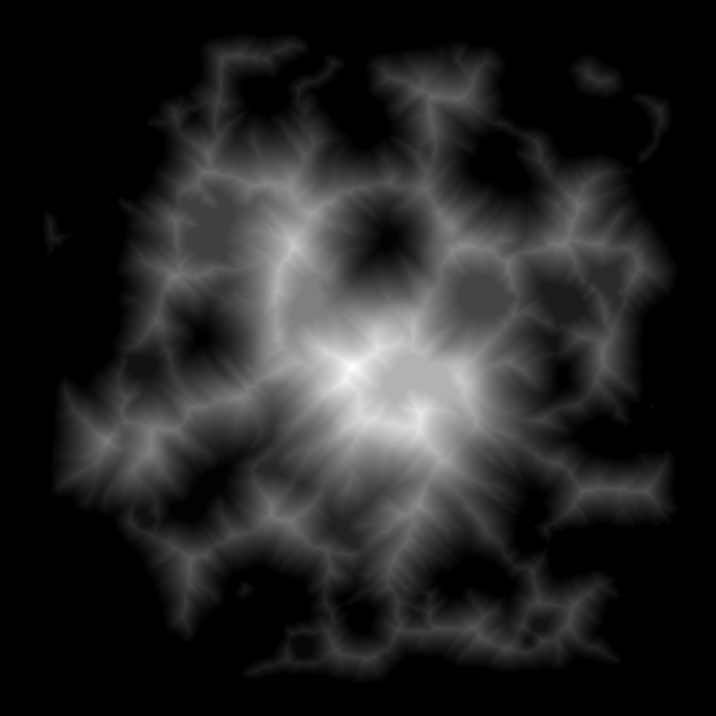

# Islands
WIP of a procedural island generator.

As it stands now it generates a height map of a single island and outputs it into terrain.png

# Build and Run
As the project is Rust-based, there needs to be a functioning Rust compiler installed.

To compile and run, use `cargo run --release`. 
The release flag is not strictly needed, but it speeds up the program a lot and doesn't take much longer to compile.

# Examples

